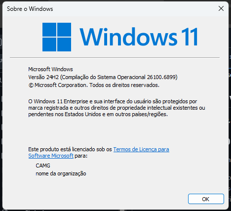
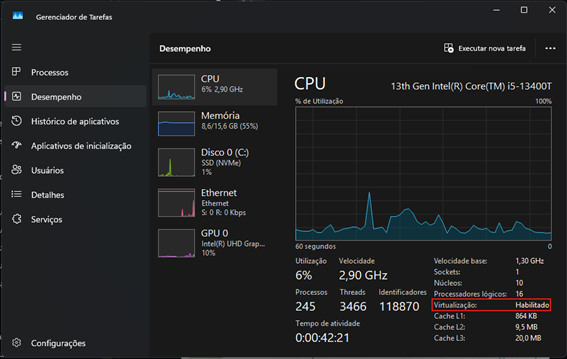
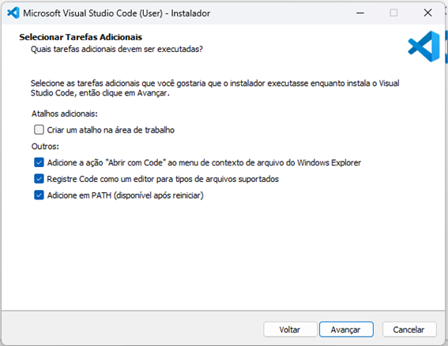
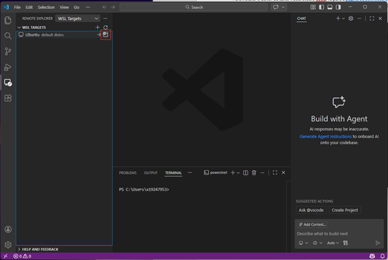
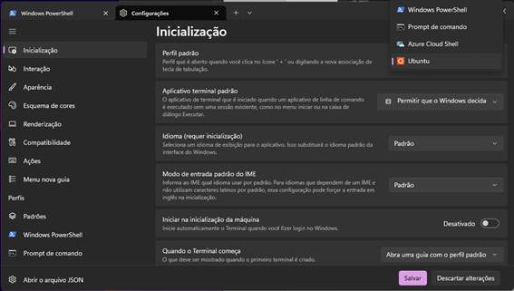
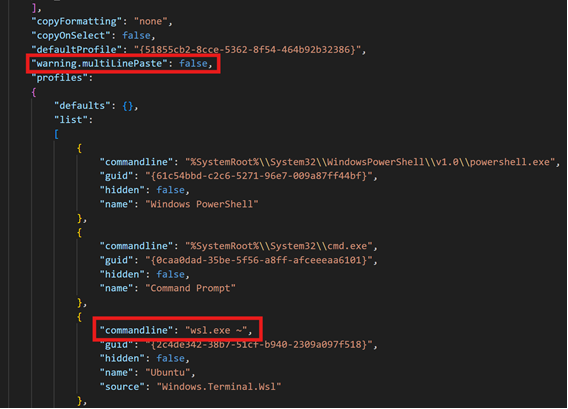
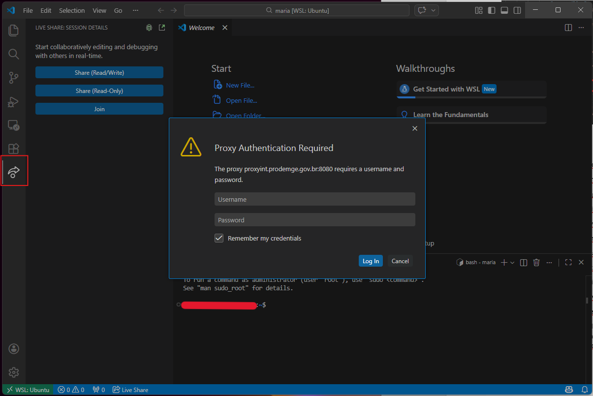
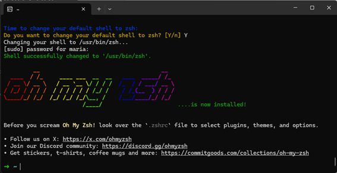

# Setup da máquina

Neste treinamento, montamos um passo a passo com instruções para configurar a máquina, com base no [tutorial de setup do Le Wagon](https://github.com/lewagon/setup/blob/master/windows.pt.md).

Você deve ter permissão de Administrador da máquina para conseguir realizar as instalações. Para isso, faça a solicitação conforme orientações "[Permissão para Gerenciar o Próprio Computador](https://cecad365.sharepoint.com/:u:/r/sites/cartadeservicos/SitePages/Administrador-Local-da-M%C3%A1quina.aspx?csf=1&web=1&e=1I6m5p)" da carta de serviços Subgef.

<!-- more -->

## 1. Criação da conta no GitHub

No [GitHub](https://github.com/), crie um conta, caso ainda não possua e informe:

* **E-mail**: preferencialmente e-mail pessoal;
* **Password**;
* **Username**: nome simples, fácil de lembrar, ficará visível para demais usuários.

Após a criação, adicione uma foto para que demais usuários possam reconhece-lo.

### 1.1 Autenticação em dois fatores

Ative a autenticação em dois fatores do GitHub em: *Settings* > *Password and authentication*.
Dentro da seção "*Two-factor authentication*", escolha o método que preferir.

Caso opte por "*Authenticator app*", é possível escolher o aplicativo "*Authenticator*" da Microsoft. Assim, será liberado um QR Code para que você escaneie e, sempre que fizer login, será requisitado um código, que pode ser resgatado no aplicativo.


## 2. Versão do Windows

Para consultar a versão do Windows, pressione `Windows` + `R` e escreva `winver`. Ao apertar `Enter` ou clicar em "OK", ele irá te mostrar a versão do Windows do seu computador.



Caso seja Windows 11 ou Windows 10 (versão superior a 2004), pode-se prosseguir com o tutorial, mas caso contrário, deve-se conferir se há algum update disponível, utilizando os botões `Windows` + `R` e escrevendo `ms-settings:windowsupdate`.


## 3. Virtualização

Outro ponto importante é consultar se a virtualização está habilitada. Para isso, pressione `Windows` + `R`, escreva `taskmgr` e consulte a aba de "Desempenho".



??? warning "Virtualização desativada"
    Se a virtualização estiver desativada, é necessário acessar o BIOS/UEFI do computador para ativá-lo.

    * Pressione `Windows` + `R`
    * Digite `shutdown.exe /r /o /t 1`
    * Aguarde o computador desligar
    * Clique em "Solucionar problemas"
    * Clique em "Opções avançadas"
    * Clique em "Configurações de firmware UEFI"
    * Clique em "Reiniciar"

    A opção de ativar a virtualização, na maioria das vezes, está nas configurações avançadas, nas configurações da CPU ou nas configurações do Northbridge. Ela pode estar nomeada como "Intel VT-x", "Tecnologia de virtualização Intel", "Extensões de virtualização", "Vanderpool" e entre outros no caso da Intel, ou como "Modo SVM" ou "AMD-V", no caso de AMD. Salve as alterações após a ativação e reinicie o computador através da opção apropriada.

## 4. Configurar proxy (CAMG)

Caso esteja na CAMG, será necessário configurar proxy.

Para isso, pesquise no Windows por "Editar as variáveis de ambiente do sistema" e clique em "Variáveis de Ambiente...". Nas variáveis de usuário, clique em "Novo...".

O valor a ser informado da variável deve ser solicitado a algum membro da equipe. Esta informação também pode ser consultada no Bitwarden da assessoria.

O terminal deve ser reiniciado para aceitar a nova configuração.


## 5. Subsistema Windows para Linux (WSL)

O [WSL](https://learn.microsoft.com/en-us/windows/wsl/faq) é o ambiente de desenvolvimento que será utilizado para executar o Ubuntu. Para instalar:

*	Pressione `Windows` + `R`
*	Digite `cmd`
*	Pressione `Ctrl` + `Shift` + `Enter`
*	Aceite a confirmação sobre a elevação de privilégio, caso apareça.
*	Execute o comando `wsl --install`

??? warning "Solução de problemas para Windows 10"
    #### Para Windows 10 < 2004: instale o WSL 1 primeiro

    * Pressione `Windows` + `R`
    * Digite `powershell`
    * Pressione **`Ctrl` + `Shift` + `Enter`**

    Você pode ter que aceitar a confirmação do UAC sobre a elevação de privilégio.

    Uma janela de terminal azul aparecerá:
    * Copie os seguintes comandos um por um (`Ctrl` + `C`)
    * Cole-os na janela do PowerShell (`Ctrl` + `V` ou clicando com o botão direito na janela)
    * Execute-os pressionando `Enter`

    ```powershell
    Enable-WindowsOptionalFeature -Online -FeatureName Microsoft-Windows-Subsystem-Linux
    ```

    ```powershell
    dism.exe /online /enable-feature /featurename:Microsoft-Windows-Subsystem-Linux /all /norestart
    ```

    ```powershell
    dism.exe /online /enable-feature /featurename:VirtualMachinePlatform /all /norestart
    ```

    :heavy_check_mark: Se todos os três comandos foram executados sem nenhum erro, reinicie o computador e continue abaixo :+1:

    :x: Se você encontrar uma mensagem de erro (ou se vir algum texto em vermelho na janela), por favor **entre em contato com um professor**

    #### Para Windows 10 com WSL 1: Atualizar para WSL 2

    Se você estiver executando o Windows 10, atualizaremos o WSL para a versão 2.

    Assim que o computador for reiniciado, precisamos baixar o instalador WSL2.

    - Vá para a [página de download](https://aka.ms/wsl2kernel)
    - Baixe o "pacote de atualização do kernel WSL2 Linux"
    - Abra o arquivo que você acabou de baixar
    - Clique em `Avançar`
    - Clique em `Concluir`

    :heavy_check_mark: Se não encontrou nenhuma mensagem de erro, você está pronto :+1:

    :x: Se você encontrar o erro "Esta atualização se aplica apenas a máquinas com o subsistema Windows para Linux", **clique com o botão direito** no programa e selecione `uninstall`; você poderá instalá-lo normalmente desta vez.

    #### Para Windows 10 com WSL 1: Torne o WSL 2 o subsistema Windows padrão para Linux

    Se você estiver executando o Windows 10, definiremos a versão padrão do WSL como 2.

    Agora que o WSL 2 está instalado, vamos torná-lo a versão padrão:
    * Pressione `Windows` + `R`
    * Digite `cmd`
    * Pressione `Enter`

    Na janela que aparece, digite:

    ```bash
    wsl --set-default-version 2
    ```

    :heavy_check_mark: Se você vir "A operação foi concluída com sucesso", você pode fechar este terminal e continuar seguindo as instruções abaixo :+1:

    :x: Se a mensagem que você receber for sobre Virtualização, por favor **entre em contato com um professor**

    ??? warning "Ativar recurso Windows da Plataforma de Máquina Virtual"

        Siga as etapas descritas [aqui](https://www.configserverfirewall.com/windows-10/please-enable-the-virtual-machine-platform-windows-feature-and-ensure-virtualization-is-enabled-in- the-bios/#:~:text=To%20enable%20WSL%202,%20Open,Windows%20feature%20on%20or%20off.&text=Garanta%20que%20the%20Virtual%20Machine,Windows%20will%20enable%20WSL %202) até você ativar a **Plataforma de Máquina Virtual** e o **Subsistema Windows para Linux**.

    ??? warning "Ativar recurso Hyper-V do Windows"

        Siga as etapas descritas [aqui](https://winaero.com/enable-use-hyper-v-windows-10/) até ativar o grupo <strong>Hyper-V</strong>

        :information_source: Se você estiver executando o Windows 10 **Home edition**, o recurso Hyper-V não estará disponível para o seu sistema operacional. Não bloqueia e você ainda pode continuar seguindo as instruções abaixo :ok_hand:


## 6. Ubuntu

O processo anterior instala o Ubuntu e, neste terminal, é solicitado que você defina um nome de usuário e uma senha.

**Observação**: Ao digitar a senha, nada aparecerá na tela, pois é um recurso de segurança para mascarar a senha. Após digitar a senha, pressione `Enter`.

### 6.1 Versão do Ubuntu

Para conferir a versão do Ubuntu, pressione `Windows` + `R`, escreva `cmd` e digite o comando `wsl -l -v`. Se a versão apontada não for a 2, escreva o comando `wsl --set-version Ubuntu 2`.

### 6.2 Conferencia do nome de usuário

Por fim, para ter certeza que foi criado um usuário, escreva `whoami` no terminal do Ubuntu. Ao apertar `Enter`, ele deve retornar o nome que você deu ao seu usuário.

### 6.3 Configurar proxy

O proxy também deve ser configurado no Linux, pois se trata de uma máquina diferente. Para isso, no terminal Ubuntu, abra o arquivo .bashrc no seu diretório pessoal com o nano:

```bash
nano ~/.bashrc
```

Role a página até o final do arquivo e adicione uma linha para cada variável de ambiente:

```bash
export NOME_VARIAVEL="valor"
```

Para o valor da variável, utilize o mesmo do tópico "4. Configurar proxy (CAMG)"

Salve o arquivo (no nano, pressione `Ctrl` + `O`, depois `Enter` e, em seguida, `Ctrl` + `X` para sair).

Recarregue a configuração para que as alterações entrem em vigor imediatamente ou feche e abra novamente o terminal:

```bash
source ~/.bashrc
```

Teste sua variável, substituindo "NOME_VARIAVEL" pelo nome da sua variável.
```bash
echo $NOME_VARIAVEL
```

## 7. Visual Studio Code

### 7.1 Instalação

Para instalar o editor de texto [Visual Studio Code](https://code.visualstudio.com/), vá para a [página de download do Visual Studio Code](https://code.visualstudio.com/download) e clique no botão "Windows". Abra o arquivo baixado e o instale com as seguintes opções:



Quando a instalação for concluída, inicie o VS Code.

### 7.2 Conectando o VS Code ao Ubuntu

Para fazer com que o VS Code interaja corretamente com o Ubuntu, no terminal do Ubuntu, cole o seguinte comando:

```bash
code --install-extension ms-vscode-remote.remote-wsl
```

Na aba de "Remote Explorer", deve constar o Ubuntu. Você pode abri-lo na janela atual ou abrir uma nova. Dessa forma, na parte inferior da janela irá constar "WSL: Ubuntu".




## 8. Windows Terminal

??? note "Windows 10: Instalar Windows Terminal"

    Abra a "Microsoft Store" e procure por "Windows Terminal" na barra de pesquisa. Selecione "Terminal do Windows" e clique em "Instalar".

    :warning: Não instale o **Windows Terminal Preview**, apenas o **Windows Terminal**!

    ??? note "Desinstale a versão errada do Terminal do Windows"

        Para desinstalar uma versão errada do Terminal Windows, basta ir até a Lista de Programas Instalados do Windows 10:

        * Pressione `Windows` + `R`
        * Digite `ms-settings:appsfeatures`
        * Pressione `Enter`

        Encontre o software para desinstalar e clique no botão desinstalar.

        Assim que a instalação for concluída, o botão "Instalar" se torna um botão "Iniciar": clique nele.

Para tornar o Ubuntu o terminal padrão, com o Terminal do Windows aberto, pressione `Ctrl` + `,` e altere o perfil padrão para "Ubuntu". Clique em "Salvar".



Depois, clique em "Abrir o arquivo JSON" e faça as seguintes edições:

1. Acrescente a linha abaixo, após =="defaultProfile": "{...}",==:

    ```bash
    "warning.multiLinePaste": false,
    ```

2. Acrescente a linha abaixo, onde contém =="name": "Ubuntu",==:

    ```bash
    "commandline": "wsl.exe ~",
    ```



Salve as alterações apertando `Ctrl` + `S` e feche o arquivo JSON.

Agora, ao abrir o Terminal do Windows, ele irá iniciar o Ubuntu por padrão.

## 9. Configurações do VS Code

### 9.1 Extensões

Copie e cole os códigos com as extensões abaixo no terminal Ubuntu.

```bash
code --install-extension ms-vscode.sublime-keybindings
code --install-extension emmanuelbeziat.vscode-great-icons
code --install-extension github.github-vscode-theme
code --install-extension MS-vsliveshare.vsliveshare
code --install-extension shopify.ruby-lsp
code --install-extension dbaeumer.vscode-eslint
code --install-extension Rubymaniac.vscode-paste-and-indent
code --install-extension alexcvzz.vscode-sqlite
code --install-extension anteprimorac.html-end-tag-labels
code --install-extension rayhanw.erb-helpers
```

### 9.2 Configuração do Live Share

O Live Share é uma extensão do VS Code que permite compartilhar o código no editor de texto para depuração e programação em pares. Para configurá-lo, inicie o VS Code e, em seu terminal, execute o comando `code`.

Vá até a aba "Live Share" com ícone de seta.

**Observação**: Caso esteja na CAMG, será necessário informar seu login e senha da rede.



Após isso, clique em "Share (Read/Write)" e depois em "GitHub", para fazer login na sua conta. Um pop-up irá aparecer solicitando que seja feito o login, clique em "Permitir".

Assim, você será redirecionado para uma página no GitHub, em seu navegador, solicitando autorização do Visual Studio Code. Clique em "Continuar" e em "Autorizar GitHub". Irão aparecer alguns pop-ups adicionais, que você pode fechar.


## 10 Ferramentas de linha de comando

### 10.1 Localidade

Para verificar a localidade, que é um mecanismo que permite personalizar programas de acordo com seu idioma e país, digite `locale` no terminal do Ubuntu.

Se a saída não contiver `LANG=en_US.UTF-8`, execute o seguinte comando em um terminal Ubuntu para instalar a localidade em inglês:

```bash
sudo locale-gen en_US.UTF-8
```

Digite a sua senha, quando solicitado.

??? warning "Caso não consiga mudar a localidade"
    Caso receba o aviso `bash: warning: setlocale: LC_ALL: cannot change locale (en_US.utf-8)`, execute os comandos a seguir:
    ```bash
    sudo update-locale LANG=en_US.UTF8
    sudo apt-get update
    sudo apt-get install language-pack-en language-pack-en-base manpages
    ```

### 10.2 Zsh e Git

Ao invés de usar o `bash` [shell](https://en.wikipedia.org/wiki/Shell_(computing)), será utilizado o `zsh`, bem como o [`git`](https://git-scm.com/), para controle de versão.

Para instalá-los, junto com outras ferramentas, abra o terminal Ubuntu e execute os seguintes comandos:
```bash
sudo apt update
sudo apt install -y curl git imagemagick jq unzip vim zsh tree
```

Digite a sua senha, quando solicitado.

### 10.3 Instalação da CLI do GitHub

Para instalar a CLI (interface de comando), execute os comandos abaixo e digite sua senha, quando solicitado:

```bash
sudo apt remove -y gitsome # gh command can conflict with gitsome if already installed
```

```bash
curl -fsSL https://cli.github.com/packages/githubcli-archive-keyring.gpg | sudo dd of=/usr/share/keyrings/githubcli-archive-keyring.gpg
```

```bash
echo "deb [arch=$(dpkg --print-architecture) signed-by=/usr/share/keyrings/githubcli-archive-keyring.gpg] https://cli.github.com/packages stable main" | sudo tee /etc/apt/sources.list.d/github-cli.list > /dev/null
```

```bash
sudo apt update
```

```bash
sudo apt install -y gh
```

Para verificar se o `gh` foi instalado, execute `gh --version`.


## 11. Oh-My-Zsh

Para instalar o plugin [`zsh`](https://ohmyz.sh/), execute o seguinte comando no terminal Ubuntu:

```bash
sh -c "$(curl -fsSL https://raw.github.com/ohmyzsh/ohmyzsh/master/tools/install.sh)"
```

Digite `Y` para a pergunta "Do you want to change your default shell to zsh?" e digite sua senha, quando solicitado.



### 11.1 Configurar proxy

Refaça o passo a passo do tópico "6.3 Configurar proxy", substituindo "~/.zshrc" ao invés de "~/.bashrc".


## 12. Vinculando seu navegador padrão ao Ubuntu

Para ter certeza que será possível interagir com o navegador instalado no Windows a partir do terminal Ubuntu, deve-se defini-lo como navegador padrão.

??? note "Google Chrome como navegador padrão"

    Execute o comando:

    ```bash
    ls /mnt/c/Program\ Files\ \(x86\)/Google/Chrome/Application/chrome.exe
    ```

    :x: Caso tenha recebido um erro como `ls: não é possível acessar...`, execute os seguintes comandos:

     ```bash
     echo "export BROWSER=\"/mnt/c/Program Files/Google/Chrome/Application/chrome.exe\"" >> ~/.zshrc
     echo "export GH_BROWSER=\"'/mnt/c/Program Files/Google/Chrome/Application/chrome.exe'\"" >> ~/.zshrc
     ```

    :heavy_check_mark: Caso não tenha recebido nenhum erro, execute os seguintes comandos:

     ```bash
     echo "export BROWSER=\"/mnt/c/Program Files (x86)/Google/Chrome/Application/chrome.exe\"" >> ~/.zshrc
     echo "export GH_BROWSER=\"'/mnt/c/Program Files (x86)/Google/Chrome/Application/chrome.exe'\"" >> ~/.zshrc
     ```


??? note "Mozilla Firefox como seu navegador padrão"

    Execute o comando:

    ```bash
    ls /mnt/c/Program\ Files\ \(x86\)/Mozilla\ Firefox/firefox.exe
    ```

    :x: Caso tenha recebido um erro como `ls: não é possível acessar...`, execute os seguintes comandos:

     ```bash
     echo "export BROWSER=\"/mnt/c/Program Files/Mozilla Firefox/firefox.exe\"" >> ~/.zshrc
     echo "export GH_BROWSER=\"'/mnt/c/Program Files/Mozilla Firefox/firefox.exe'\"" >> ~/.zshrc
     ```

    :heavy_check_mark: Caso não tenha recebido nenhum erro, execute os seguintes comandos:

     ```bash
     echo "export BROWSER=\"/mnt/c/Program Files (x86)/Mozilla Firefox/firefox.exe\"" >> ~/.zshrc
     echo "export GH_BROWSER=\"'/mnt/c/Program Files (x86)/Mozilla Firefox/firefox.exe'\"" >> ~/.zshrc
     ```

??? note "Microsoft Edge como navegador padrão"

    Execute os comandos:

    ```bash
    echo "export BROWSER=\"/mnt/c/Program Files (x86)/Microsoft/Edge/Application/msedge.exe\"" >> ~/.zshrc
    echo "export GH_BROWSER=\"'/mnt/c/Program Files (x86)/Microsoft/Edge/Application/msedge.exe'\"" >> ~/.zshrc
    ```

Reinicie seu terminal e, para conferir se o Browser foi definido corretamente, execute o comando abaixo:

```bash
[ -z "$BROWSER" ] && echo "ERROR: please define a BROWSER environment variable ⚠️" || echo "Browser defined 👌"
```

Caso não retorne a mensagem, tente outro navegador e não esqueça de resetar o terminal com o comando `exec zsh`.


## 13. Utilizando o GitHub CLI

Primeiramente, vamos usar o [GitHub CLI](https://cli.github.com/) (`gh`) para conectar ao GitHub usando SSH, um protocolo para fazer login usando chaves SSH, ao invés de usuário/senha. Dessa forma, execute o seguinte comando no terminal do Ubuntu:

```bash
gh auth login -s 'user:email' -w --git-protocol ssh
```

:warning: Não edite o "email".

O gh fará algumas perguntas:

1. **Generate a new SSH key to add to your GitHub account?**: Pressione `Enter` para pedir ao gh para gerar as chaves SSH para você.

    Se você já possui chaves SSH, verá **Upload your SSH public key to your GitHub account?**. Com as setas, selecione o caminho do arquivo de sua chave pública e pressione `Enter`.

2. **Enter a passphrase for your new SSH key (Optional)**: Digite algo que você deseja e que você lembrará. É uma senha para proteger sua chave privada armazenada no disco rígido. Em seguida, pressione `Enter`.

    :warning: Recomendamos que pressione `Enter`, para que não seja necessário digitar o "passphrase" a todo momento.

3. **Title for your SSH key**: Você pode deixá-lo no "GitHub CLI" proposto, pressione `Enter`.

Você obterá então a seguinte saída:

```bash
! First copy your one-time code: 0EF9-D015
- Press Enter to open github.com in your browser...
```

Siga as instruções de copiar o código e depois pressione `Enter`.

O navegador será aberto e irá solicitar que você autorize o GitHub CLI a usar sua conta GitHub. Aceite, informe o código que lhe foi passado e autorize o GitHub (será necessário informar o código da autenticação de dois fatores).

Para verificar se você está conectado corretamente, execute:

```bash
gh auth status
```


## 14. Dotfiles (configuração padrão)

No terminal do Ubuntu, defina uma variável para seu nome de usuário GitHub:

```bash
export GITHUB_USERNAME=`gh api user | jq -r '.login'`
```

```bash
echo $GITHUB_USERNAME
```

Esta variável só é definida enquanto o terminal estiver aberto. Se ele for fechado, esta etapa deve ser refeita.

### 14.1 Configurar protocolo ssh

Abra o arquivo "~/.ssh/config" no seu diretório pessoal com o nano:

```bash
nano ~/.ssh/config
```

Adicione, no arquivo, as linhas a seguir:

```
Host github.com
  HostName ssh.github.com
  Port 443
  User git
  IdentitiesOnly yes
  AddKeysToAgent yes
  IdentityFile ~/.ssh/id_ed25519
  IdentityFile ~/.ssh/id_rsa
```

Feche o arquivo e execute o código:

```
ssh -T git@github.com
```

**Obs.**: ao tentar autenticar no GitHub utilizando o CLI `gh` pode aparecer o erro:

```
could not prompt: Incorrect function.
You appear to be running in MinTTY without pseudo terminal support.
To learn about workarounds for this error, run:  gh help mintty
```

Para isso, pode-se tentar utilizar o `winpty` antes do comando:

```
winpty gh auth login
```

### 14.2 Fork do repositório Dotfiles

A SPLOR utiliza um fork próprio do [repositório original do Le Wagon](https://github.com/lewagon/dotfiles), que contém as configurações padrão recomendadas pela equipe.

Utilize sempre o repositório corporativo [splor-mg/dotfiles](https://github.com/splor-mg/dotfiles), que possui uma configuração padrão que pode ser utilizada, mas que deve ser clonada no computador, uma vez que a configuração é pessoal.

Para isso, execute os seguintes comandos:

```bash
mkdir -p ~/code/$GITHUB_USERNAME && cd $_
```

```bash
gh repo fork splor-mg/dotfiles –clone
```

### 14.3 Instalador do Dotfiles

Execute o instalador `dotfiles`:

```bash
cd ~/code/$GITHUB_USERNAME/dotfiles
```

```bash
zsh install.sh
```

```bash
gh api user/emails | jq -r '.[].email'
```

Ele pode te pedir para rodar a linha abaixo:

```bash
gh auth refresh -h github.com -s user
```

Isso fará com que você tenha novamente que autenticar no GitHub. Após isso, rode novamente a última linha que deu erro.
Assim, você deve receber uma lista com seus e-mails registrados.

### 14.4 Instalador git

Execute o instalador git:

```bash
cd ~/code/$GITHUB_USERNAME/dotfiles && zsh git_setup.sh
```

Ele irá te solicitar seu nome (Nome Sobrenome) e seu e-mail, que deverá ser um dos listados anteriormente. Este email será exibido publicamente na internet, então, caso não queira que seu e-mail apareça em repositórios públicos aos quais você possa contribuir, selecione o endereço @users.noreply.github.com.

Agora reinicie o terminal executando:

```bash
exec zsh
```


## 15. Desativar prompt de senha SSH

Para que a senha não seja solicitada sempre que for comunicar com um repositório distante, é necessário adicionar o plugin `ssh-agent` ao `oh my zsh`.

Para isso, primeiramente, abra o arquivo `.zshrc`, executando o seguinte comando no terminal Ubuntu:

```bash
code ~/.zshrc
```

No arquivo aberto, identifique a linha que começa com `plugins=` e adicione `ssh-agent` no final dessa lista.

Salve o arquivo `.zshrc` com `Ctrl` + `S` e feche o editor de texto.


## 16. Instalar o Poetry

### 16.1 Voltando à home (Opcional)

Primeiro, caso queira voltar o diretório para a home (~), digite o comando:

```bash
cd
```

### 16.2 Atualização do Python (Opcional)

Caso queira também, confira a versão atual do Python com `python3 --version` e atualize os repositórios e os pacotes com os comandos a seguir:

```bash
sudo apt update
```

```bash
sudo apt upgrade -y
```

Instale a versão mais recente do Python disponível nos repositórios:

```bash
sudo apt install -y python3 python3-pip python3-venv
```

### 16.3 Instalação do Poetry

Agora, instale o pipx com os comandos a seguir:

```bash
sudo apt install -y pipx
```

```bash
pipx ensurepath
```

Abra um novo terminal ou aplique o PATH manualmente:

```bash
source ~/.bashrc
```

Verifique a instalação, consultando a versão através do comando `pipx --version`.

Por fim, instale o Poetry:

```bash
pipx install poetry
```


## 17. Ambiente virtual com o Poetry (bônus)

Por padrão, o Poetry cria os ambientes virtuais em um diretório global (fora do projeto), como `~/.cache/pypoetry/virtualenvs/...`. Por isso, é necessário [configurar](https://python-poetry.org/docs/configuration/#virtualenvsin-project) para que todos os projetos Poetry criem .venv por padrão.

No terminal Ubuntu, execute o comando abaixo e, caso queira consultar sua lista de configurações, execute `poetry config --list`.

```bash
poetry config virtualenvs.in-project true
```

Após isso, dentro de um repositório que possui o arquivo "pyproject.toml", execute:

```bash
poetry env activate
source .venv/bin/activate
```

Ou apenas:

```bash
eval $(poetry env activate)
```

**Observação**: caso já haja um ambiente virtual criado para aquele repositório (e caso esteja em .cache), será necessário excluir a pasta antes de executar o comando anterior. Consulte esse caminho pelo comando `poetry env info --path`.

Assim, execute o comando abaixo para que seja instalada todas as suas dependências dentro do seu novo ambiente virtual.

```bash
poetry install
```

Para sair, execute o comando `deactivate` e, para retornar, execute apenas `source .venv/bin/activate`.

**Observação**: Dentro desse ambiente, não é necessário usar `poetry run` antes de todos os comandos.


## 18. Conclusão

Agora finalmente a sua máquina está configurada e você pode dar início aos seus trabalhos.

Espero que tudo tenha dado certo até aqui, mas, caso tenha encontrado algum problema, você pode procurar as soluções na internet e nos nossos issues ou perguntar se algum membro da equipe já passou por isso.

Desejo uma boa sorte na sua nova jornada!
