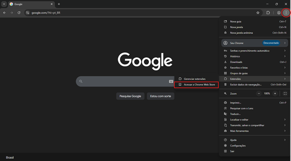
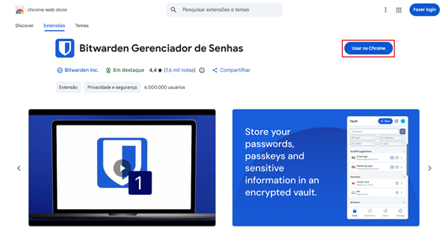
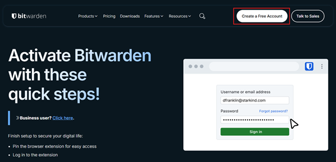
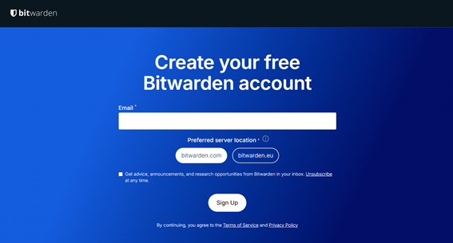
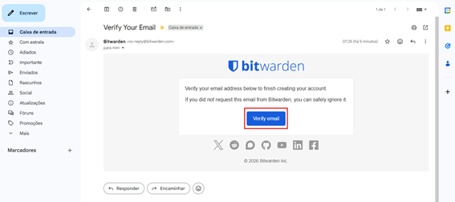
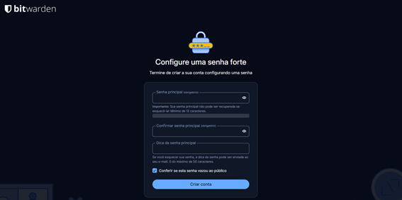
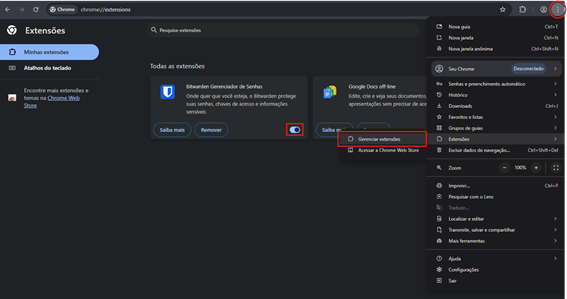
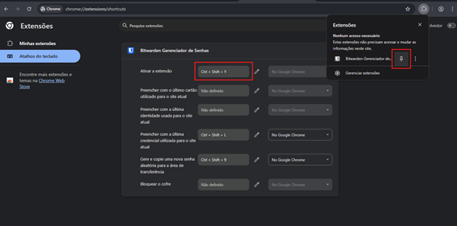
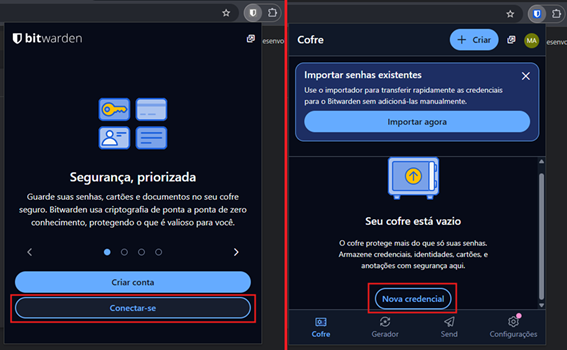
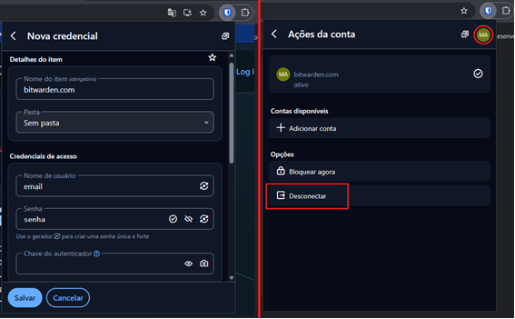

# Criação de conta no Bitwarden

Neste treinamento, montamos um passo a passo com instruções para que você possa criar uma conta no **Bitwarden**, um cofre para gestão de senhas.

Saiba mais no post: [Bitwarden - Cofre de Senhas](https://splor-mg.github.io/handbook/gestao_splor/governanca/bitwarden_cofre_senhas/).

<!-- more -->

## 1. Instalando a extensão no Google Chrome

Acesse a loja de extensões do Google Chrome.

Pesquise na loja por [Bitwarden Gerenciador de Senhas](https://chromewebstore.google.com/detail/bitwarden-gerenciador-de/nngceckbapebfimnlniiiahkandclblb?utm_source=ext_app_menu) e clique em "Usar no Chrome".

## 2. Criando uma conta pessoal

Após a instalação da extensão ser concluída, uma [nova página](https://bitwarden.com/browser-start/) será aberta.

Clique em "Create a Free Account".

Você será redirecionado para uma [nova tela](https://bitwarden.com/go/start-free/).

Insira seu e-mail (preferencialmente o pessoal, caso queira).

Você deverá receber um e-mail solicitando a verificação da sua conta, abra-o e clique em "Verify email".

Para finalizar a criação da sua conta pessoal, escolha uma senha de no mínimo 12 caracteres.

## 3. Ativando a conta

Agora, vamos confirmar se a extensão está ativada.

Clique nos três pontinhos, vá em "Extensões" e clique em "Gerenciar extensões".

O **Bitwarden Gerenciados de Senhas** deve estar ativado.

Aperte `Ctrl` + `Shift` + `Y` ou fixe a extensão como uma guia do seu navegador.

Assim, você conseguirá acessar a tela de login do Bitwarden, bastando informar seu e-mail e senha definidos na etapa anterior.

Clique em "Nova credencial" e preencha as informações da conta com o e-mail e a senha do Bitwarden da assessoria que te for passado.

Após clicar em Salvar, volte para a tela inicial e desconecte da conta.

Faça login no Bitwarden com a conta da assessoria para ter acesso às senhas salvas de uso da organização.

## 4. Conclusão

A partir de agora, sempre que precisar consultar alguma senha da organização, você poderá acessá-la a partir do cofre de senhas do Bitwarden.

Fique à vontade para utilizar a sua conta pessoal no Bitwarden para salvar e gerenciar suas próprias senhas.
