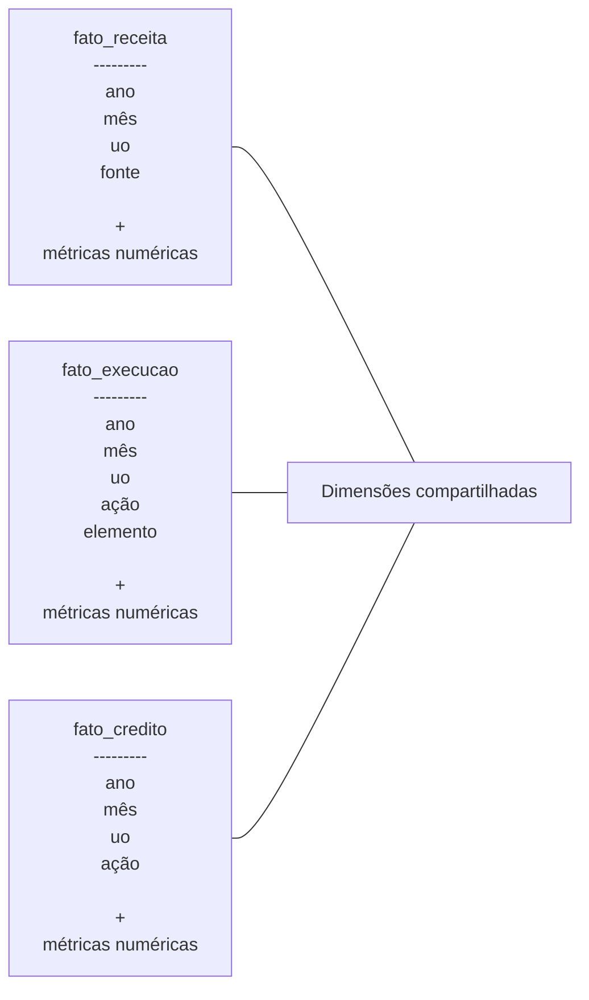
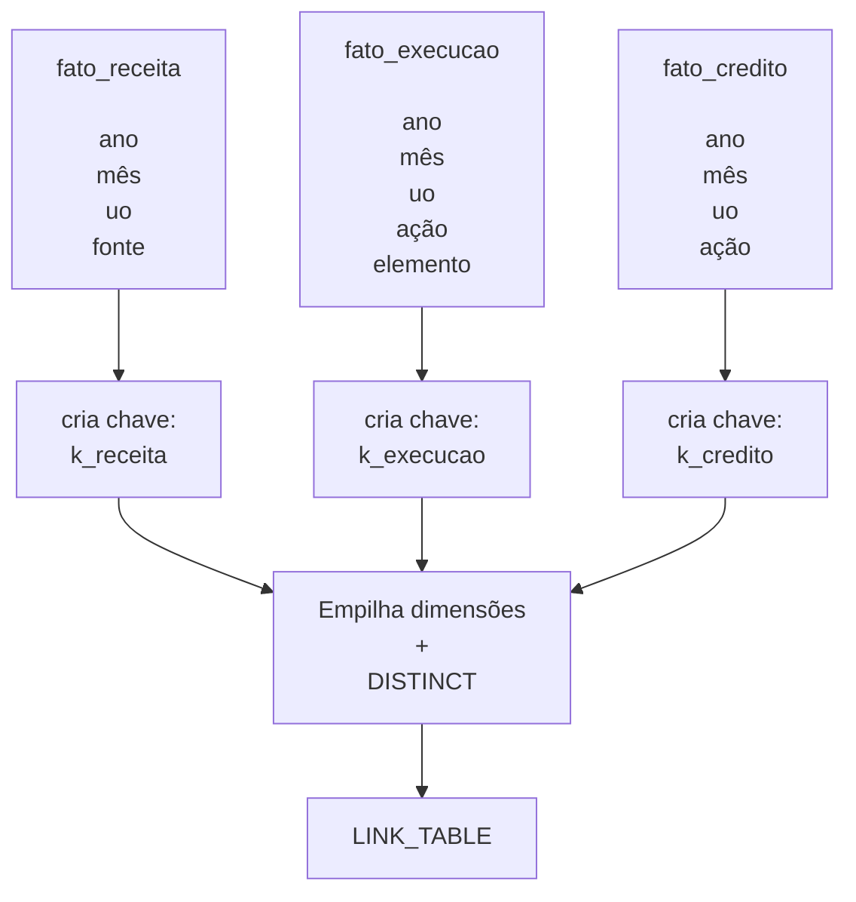
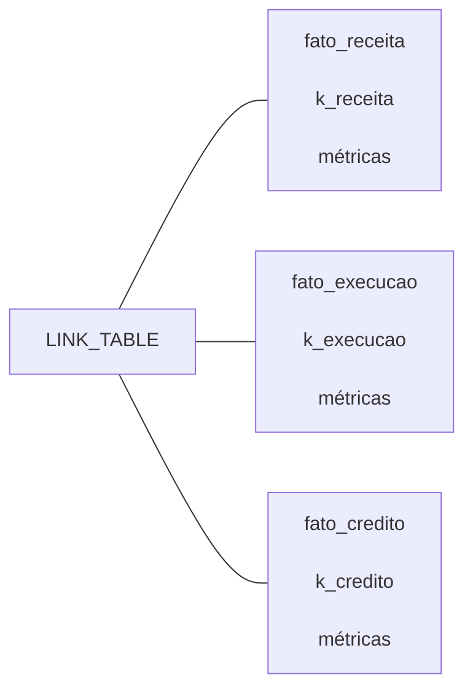

#  Arquitetura Analítica por trás do Relatório Operacional

A equipe da Splor-MG conta com o **painel relatório operacional** (roperacional) para realizar suas análises em nível gerencial. Este painel agrupa relatórios, a partir de dados históricos e atualizados, dos principais fluxos orçamentários do estado existentes no armazém de informações, universos SIAFI e SIAD, e da reestimativa de receitas e despesas, em diferentes níveis de agregação[^1].

Atualmente, a construção deste painel se baseia em códigos da linguagem R e na ferramenta de visualização [QlikView](https://www.qlik.com/us/products/qlikview)[^2]. Considerando a descontinuidade da ferramenta do Qlik e a padronização dos processos de ETL utilizando a linguagem Python, a ideia deste post é consolidar alguns dos conceitos arquiteturais da construção do relatório operacional, bem como descrever o processo de reconstrução desse painel a partir dessas mudanças programadas.

<!-- more -->

## Contexto Conceitual

Para compreensão dos conceitos e técnicas aplicadas nesse processo, é preciso entender que estes fazem parte da área de conhecimento de Modelagem de Dados[^3], que é uma subárea de Banco de Dados dentro da Ciência de Dados, Engenharia de Dados e Business Intelligence (BI).
```
Computação / Sistemas de Informação
        │
        └── Banco de Dados
              │
              ├── Modelagem de Dados
              │     ├── Modelo Relacional
              │     ├── Normalização
              │     └── Modelagem Dimensional
              │            ├── Tabelas Fato
              │            ├── Tabelas Dimensão
              │            ├── Star Schema
              │            └── Snowflake Schema
              │
              ├── Data Warehouse
              ├── Data Mart
              ├── Business Intelligence (BI)
              └── Engenharia de Dados
```
Não é nosso objetivo esgotar os conceitos, entretanto se faz mister o nivelamento do tópico _Modelagem Dimensional_ de maneira contextualizada à Splor.

### Modelagem Dimensional

A modelagem dimensional é uma técnica de modelagem de dados criada especificamente para ambientes analíticos. E, foi, portanto, escolhida como técnica para a construção do roperacional[^1].

Esta técnica organiza os dados em duas categorias: _fatos_ e _dimensões_. Os fatos são implementados por meio de tabelas fato e as dimensões por meio de tabelas dimensão. A ideia central é separar o evento que aconteceu do contexto que explica esse evento. Por exemplo, para responder à pergunta _Quanto foi gasto por unidade orçamentária em cada mês_ temos o fato, que é o gasto, e as informações que descrevem esse gasto, que são as dimensões (unidade orçamentária, elemento de despesa, ação, etc).

```
                 Tempo
                   |
                   |
Unidade --- Execução Orçamentária --- Ação
                   |
                   |
            Elemento de Despesa
```
#### Tabelas fato vs. Tabela Dimensão

A tabela fato armazena os eventos de negócio e suas métricas numéricas, enquanto a tabela dimensão armazena os atributos descritivos. No contexto da Splor, os fatos correspondem aos eventos orçamentários e financeiros registrados nos sistemas corporativos, como execução orçamentária, arrecadação de receitas, concessão de créditos, distribuição de cotas e registros de restos a pagar.

A título de exemplo, vejamos o datapackage [dados-armazem-siafi](https://github.com/splor-mg/dados-armazem-siafi) como modelo para identificarmos e diferenciarmos as tabelas fato e tabelas dimensão. Este datapackage reúne o conjunto de dados relacionados ao Siafi, cuja estrutura pode ser lida no arquivo [datapackage.json](https://github.com/splor-mg/dados-armazem-siafi-2026/blob/main/datapackage.json), ou, esquematicamente:

```
dados-armazem-siafi

├── execucao.csv
├── credito.csv
├── cota.csv
├── receita.csv
├── alteracoes_orcamentarias.csv
├── restos_pagar.csv
└── restos_pagar_folha.csv
```
Cada um desses recursos ou tabelas está descrito nos [schemas do repositório](https://github.com/splor-mg/dados-armazem-siafi-2026/tree/main/schemas). Isto é, cada field representa uma coluna da respectiva tabela. Veja, por exemplo, o [receita.yaml](https://github.com/splor-mg/dados-armazem-siafi-2026/blob/main/schemas/receita.yaml):

```
  fields:
      - name: Ano de Exercício
        type: integer
        target: ano
      - name: Mês - Numérico
        type: integer
        target: mes_cod
      - name: Unidade Orçamentária - Código
        type: integer
        target: uo_cod
      - name: Fonte Recurso - Código
        type: integer
        target: fonte_cod
      - name: Classificação Receita - Código
        type: integer
        target: receita_cod
      - name: Classificação Receita - Formatado
        type: string
        target: receita_cod_formatado
      - name: Valor Previsto Inicial
        type: number
        target: vlr_previsto_inicial
        decimalChar: ','
      - name: Valor Previsto Adicional
        type: number
        target: vlr_previsto_adicional
        decimalChar: ','
      - name: Valor Previsto Atualizado
        type: number
        target: vlr_previsto_atualizado
        decimalChar: ','
      - name: Valor Contabilizado
        type: number
        target: vlr_contabilizado
        decimalChar: ','
      - name: Valor Efetivado Ajustado
        type: number
        target: vlr_efetivado_ajustado
        decimalChar: ','
```
Agora, se consultamos o datapackage dados-armazem-siafi-2026, que contém os dados registrados no exercício de 2026, poderemos encontrar, por exemplo, na sua pasta `/data` o arquivo `receita.csv`. Nele, podemos ver algo assim (a título exemplificativo):

| ano  | mês | uo_cod| fonte_cod | vlr_previsto_inicial | vlr_efetivado_ajustado |
| ---- | --- | ----- | ---- | -------- | ---------- |
| 2026 | 03  | 2061 | 60   |  150000  | 100000     |

Nessa tabela, os campos `vlr_previsto_inicial` e `vlr_efetivado_ajustado` representam as medidas numéricas do fenômeno observado e compõem a parte factual dos dados.

Já os campos `ano`, `mes_cod`, `uo_cod` e `fonte_cod` atuam como chaves dimensionais, permitindo relacionar o fato às respectivas tabelas dimensão, responsáveis por armazenar informações descritivas. Por exemplo:

- `uo_cod` = `2061` → Fundação Estadual;
- `fonte_cod` = `60` → Receita própria;
- `ano` = `2026` e `mes_cod` = `03` → março de 2026.

Em um modelo dimensional completo, essas descrições estariam armazenadas em tabelas específicas, como `dim_uo`, `dim_fonte` e `dim_tempo`, enquanto a tabela fato armazenaria apenas as chaves e os valores numéricos a serem analisados.

Embora o `dados-armazem-siafi` seja utilizado como exemplo neste texto, é importante destacar que ele não constitui, por si só, um modelo dimensional. Trata-se de um repositório de dados operacionais e analíticos do Siafi.

A modelagem dimensional surge posteriormente, durante a construção do relatório operacional, quando esses dados e os dados de outros dadapackages são reorganizados em tabelas fato e tabelas dimensão. Essa reorganização não é um trabalho trivial, sendo necessária a criação de estruturas auxiliares como a Linktable no ambiente do QlikView.

Tendo em vista que essa estrutura já foi pensada e criada, ela será reproduzida e adaptada para a tarefa de transformar os códigos para Python e recriar essa estrutura no novo ambiente de visualização de dados. Sendo, então, o próximo passo o estudo da Linktable.

## Linktable

Entender o porque a linktable é necessária e como ela funciona é fundamental para compreensão da arquitetura do roperacional. É importante destacar que nota "[Relacionamento das bases no relatório operacional: método Concatenate x Linktable](https://splor-mg.github.io/notas/main/20231804T160439/)" explora esse assunto, especialmente sobre o processo analítico e decisório até alcançar a construção da Linktable como solução para o desafio de construção do relatório operacional. Desse modo, o objetivo desta seção será explorar como ela é contruída.

Primeiramente, é necessário destacar que as diferentes tabelas fato resultantes dos processos orçamentários possuem subconjuntos de dimensões compartilhadas, o que permite a análise integrada dessas informações. No entanto, as tabelas fatos possuem granularidades distintas, isto é, cada uma representa um fenômeno de negócio em um nível próprio de detalhamento.



Desse modo, associá-las diretamente pode gerar ambiguidades, duplicação de registros e chaves sintéticas no Qlik, sendo necessária uma estrutura que centraliza as combinações únicas das dimensões compartilhadas pelas diferentes tabelas fato, a Linktable.

### Funcionamento da Linktable

Inicialmente, para cada conjunto de dimensões compartilhado por duas ou mais tabela fato, é criada uma chave técnica que representa a combinação dessas dimensões. Essa chave é adicionada às respectivas tabelas fato, que passam a manter apenas essa chave e suas métricas numéricas [^4].

!!! fato_receita

    === "**Antes**"

        ``` markdown
        | ano  | mês | uo    | fonte | valor  |
        | ---- | --- | ----- | ----- | ------ |
        | 2026 | 03  | 26443 | 10    | 100000 |

        ```

    === "**Após a criação das chaves**"

        ``` markdown
        | k_receita | valor  |
        | --------- | ------ |
        | R001      | 100000 |
        ```


!!! fato_execucao

    === "**Antes**"

        ``` markdown
        | ano  | mês | uo    | ação | elemento | valor  |
        | ---- | --- | ----- | ---- | -------- | ------ |
        | 2026 | 03  | 26443 | 20RK | 339030   | 150000 |

        ```

    === "**Após a criação das chaves**"

        ``` markdown
        | k_execucao | valor  |
        | ---------- | ------ |
        | E001       | 150000 |
        ```

!!! fato_credito

    === "**Antes**"

        ``` markdown
        | ano  | mês | uo    | ação | valor |
        | ---- | --- | ----- | ---- | ----- |
        | 2026 | 03  | 26443 | 20RK | 80000 |

        ```

    === "**Após a criação das chaves**"

        ``` markdown
        | k_credito | valor |
        | --------- | ----- |
        | C001      | 80000 |
        ```


Em seguida, constrói-se a Linktable empilhando as combinações de chaves e dimensões provenientes das tabelas fato e eliminando registros duplicados por meio de uma operação `distinct`.

| ano  | mês | uo    | fonte | ação | elemento | k_receita | k_execucao | k_credito |
| ---- | --- | ----- | ----- | ---- | -------- | --------- | ---------- | --------- |
| 2026 | 03  | 26443 | 10    | null | null     | R001      | null       | null      |
| 2026 | 03  | 26443 | null  | 20RK | 339030   | null      | E001       | null      |
| 2026 | 03  | 26443 | null  | 20RK | null     | null      | null       | C001      |


O resultado é uma tabela intermediária que centraliza as dimensões compartilhadas e estabelece a ligação entre as diferentes tabelas fato. Cada linha da Linktable passa a conter as chaves necessárias para relacionar os diversos conjuntos dimensionais existentes no modelo. Um detalhe importante é que cada linha não contém todas as dimensões preenchidas. Ela contém apenas as dimensões necessárias para identificar a chave correspondente.



A Linktable não armazena métricas, estas permanecem em suas respectivas tabelas fato. Seu papel é atuar como um mecanismo de navegação, permitindo que uma mesma combinação de dimensões seja utilizada para consultar e agregar métricas provenientes de diferentes fatos.



---
[^1]: Ver [Relacionamento das bases no relatório operacional: método Concatenate x Linktable](https://splor-mg.github.io/notas/main/20231804T160439/).
[^2]: Ver [Webnar Inteligência.MG #2 - Qlikview](https://splor-mg.github.io/handbook/blog/webnar-intelig%C3%AAnciamg-2---qlikview/).
[^3]: Ver[Fundamentos para Modelagem de Dados](https://splor-mg.github.io/handbook/blog/fundamentos-para-modelagem-de-dados/).
[^4]: A arquitetura conceitual não exige que as tabelas fato mantenham apenas as chaves e as métricas numéricas. Na prática, o script do Qlik pode manter outras colunas auxiliares, mas este foi o comportamento descrito na nota [nota]([^1]) mencionada.
