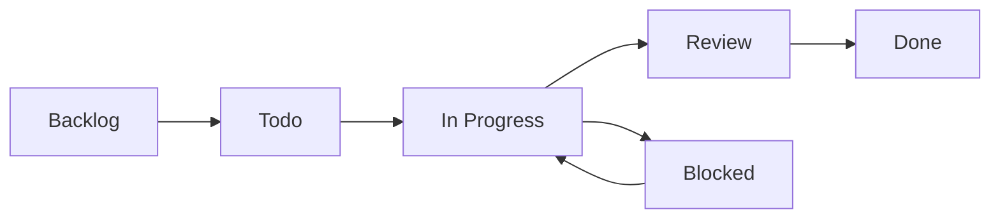

# Status de Atividades 📈

## Regras de Status

O sistema de **status** na SPLOR é fundamental para acompanhar o progresso das atividades e garantir que todos tenham visibilidade clara sobre o que está sendo trabalhado. Cada status representa uma etapa específica no ciclo de vida de uma atividade.

## Estados de Status

### Backlog 📋

#### Características
- **Atividades planejadas** mas não iniciadas
- **Priorização** definida
- **Recursos** alocados quando disponível
- **Estimativas** de tempo realizadas

#### Quando Usar
- ✅ **Novas funcionalidades** planejadas
- ✅ **Melhorias** identificadas
- ✅ **Bugs** reportados mas não críticos
- ✅ **Tarefas** de manutenção programadas

#### Regras
- **Priorização** clara definida
- **Estimativa** de tempo realizada
- **Dependências** identificadas
- **Critérios de aceitação** definidos

### Todo ✅

#### Características
- **Atividades prontas** para iniciar
- **Recursos** alocados
- **Sprint** definido
- **Desenvolvedor** responsável designado

#### Quando Usar
- ✅ **Atividade** selecionada para sprint atual
- ✅ **Recursos** disponíveis para execução
- ✅ **Dependências** resolvidas
- ✅ **Contexto** técnico claro

#### Regras
- **Assignee** definido
- **Sprint** atribuído
- **Estimativa** revisada
- **Critérios** de aceitação claros

### In Progress 🔄

#### Características
- **Atividade** em desenvolvimento ativo
- **Desenvolvedor** trabalhando
- **Progresso** sendo realizado
- **Comunicação** ativa sobre status

#### Quando Usar
- ✅ **Desenvolvimento** iniciado
- ✅ **Código** sendo escrito
- ✅ **Testes** sendo realizados
- ✅ **Documentação** sendo atualizada

#### Regras
- **Atualizações** regulares de progresso
- **Blocadores** reportados imediatamente
- **Commits** frequentes
- **Comunicação** com stakeholders

### Review 🔍

#### Características
- **Desenvolvimento** concluído
- **Pull Request** criado
- **Code review** em andamento
- **Testes** automatizados passando

#### Quando Usar
- ✅ **Código** implementado
- ✅ **PR** aberto para revisão
- ✅ **Testes** locais passando
- ✅ **Documentação** atualizada

#### Regras
- **Reviewers** designados
- **Comentários** respondidos
- **Mudanças** solicitadas implementadas
- **Aprovações** necessárias obtidas

### Done ✅

#### Características
- **Atividade** completamente finalizada
- **Código** em produção
- **Testes** passando
- **Documentação** atualizada

#### Quando Usar
- ✅ **PR** aprovado e mesclado
- ✅ **Deploy** realizado com sucesso
- ✅ **Testes** de produção passando
- ✅ **Stakeholders** notificados

#### Regras
- **Critérios de aceitação** atendidos
- **Documentação** finalizada
- **Lições aprendidas** registradas
- **Métricas** atualizadas

### Blocked 🚫

#### Características
- **Atividade** impedida de prosseguir
- **Blocador** identificado
- **Ação** necessária de terceiros
- **Progresso** paralisado

#### Quando Usar
- ✅ **Dependência** externa não resolvida
- ✅ **Decisão** pendente de stakeholder
- ✅ **Recurso** não disponível
- ✅ **Problema** técnico sem solução

#### Regras
- **Blocador** claramente documentado
- **Responsável** pela resolução identificado
- **Prazo** para resolução definido
- **Plano B** considerado

## Workflow de Status

### Fluxo Normal



### Transições de Status

#### Backlog → Todo
- **Critérios**: Atividade selecionada para sprint
- **Ação**: Definir assignee e sprint
- **Responsável**: Product Owner / Scrum Master

#### Todo → In Progress
- **Critérios**: Desenvolvedor iniciou trabalho
- **Ação**: Atualizar status e iniciar tracking
- **Responsável**: Desenvolvedor

#### In Progress → Review
- **Critérios**: Desenvolvimento concluído
- **Ação**: Criar PR e solicitar review
- **Responsável**: Desenvolvedor

#### Review → Done
- **Critérios**: PR aprovado e mesclado
- **Ação**: Finalizar atividade e atualizar métricas
- **Responsável**: Reviewer / Desenvolvedor

#### In Progress → Blocked
- **Critérios**: Blocador identificado
- **Ação**: Documentar problema e escalar
- **Responsável**: Desenvolvedor

#### Blocked → In Progress
- **Critérios**: Blocador resolvido
- **Ação**: Retomar desenvolvimento
- **Responsável**: Desenvolvedor

## Configuração no GitHub

### GitHub Projects

#### Colunas do Kanban
```
Backlog | Todo | In Progress | Review | Done
```

#### Automação de Status
- **Mover** automaticamente baseado em labels
- **Notificar** mudanças de status
- **Atualizar** métricas automaticamente
- **Gerar** relatórios de progresso

### Labels de Status

#### Labels Automáticas
- `status/backlog`: Atividade no backlog
- `status/todo`: Pronta para iniciar
- `status/in-progress`: Em desenvolvimento
- `status/review`: Em revisão
- `status/done`: Concluída
- `status/blocked`: Bloqueada

#### Labels Manuais
- `priority/high`: Alta prioridade
- `priority/medium`: Média prioridade
- `priority/low`: Baixa prioridade
- `type/bug`: Correção de bug
- `type/feature`: Nova funcionalidade
- `type/docs`: Documentação

## Métricas de Status

### Indicadores de Performance

#### Velocidade
- **Issues** movidas por sprint
- **Tempo médio** em cada status
- **Throughput** de atividades
- **Velocidade** da equipe

#### Qualidade
- **Taxa** de retorno de PRs
- **Tempo** de revisão
- **Bugs** em produção
- **Satisfação** do usuário

#### Eficiência
- **Tempo** em status "blocked"
- **Reutilização** de código
- **Automação** implementada
- **Documentação** atualizada

### Dashboards de Acompanhamento

#### Visão da Equipe
- **Distribuição** de atividades por status
- **Progresso** do sprint atual
- **Blocadores** identificados
- **Próximas** entregas

#### Visão Gerencial
- **Status** geral de todos os projetos
- **Tendências** de performance
- **Alertas** de atividades atrasadas
- **Projeções** de conclusão

## Processo de Atualização

### Responsabilidades

#### Desenvolvedor
- **Atualizar** status regularmente
- **Reportar** blocadores imediatamente
- **Comunicar** progresso
- **Documentar** mudanças

#### Scrum Master
- **Monitorar** progresso do sprint
- **Identificar** blocadores
- **Facilitar** resolução de problemas
- **Atualizar** métricas

#### Product Owner
- **Priorizar** backlog
- **Validar** entregas
- **Aprovar** mudanças de escopo
- **Comunicar** com stakeholders

### Frequência de Atualização

#### Diária
- **Status** de atividades em progresso
- **Blocadores** identificados
- **Progresso** reportado

#### Semanal
- **Revisão** de backlog
- **Planejamento** do próximo sprint
- **Métricas** atualizadas

#### Mensal
- **Análise** de tendências
- **Ajustes** no processo
- **Melhorias** identificadas

## Boas Práticas

### Para Desenvolvedores
- ✅ **Atualizar** status diariamente
- ✅ **Reportar** blocadores imediatamente
- ✅ **Manter** comunicação clara
- ✅ **Documentar** decisões importantes

### Para Gestores
- ✅ **Monitorar** progresso regularmente
- ✅ **Identificar** gargalos
- ✅ **Facilitar** resolução de problemas
- ✅ **Comunicar** com stakeholders

### Para a Equipe
- ✅ **Respeitar** as regras de status
- ✅ **Colaborar** na resolução de blocadores
- ✅ **Compartilhar** conhecimento
- ✅ **Melhorar** continuamente

## Troubleshooting

### Problemas Comuns

#### Atividades "perdidas"
- **Verificar** status atual
- **Identificar** responsável
- **Definir** próximos passos
- **Atualizar** documentação

#### Blocadores recorrentes
- **Analisar** causa raiz
- **Implementar** soluções preventivas
- **Documentar** lições aprendidas
- **Treinar** equipe

#### Status desatualizados
- **Revisar** processo de atualização
- **Treinar** equipe sobre importância
- **Implementar** automação
- **Monitorar** compliance

## Próximos Passos

1. **Configurar** automação de status
2. **Implementar** dashboards de acompanhamento
3. **Treinar** equipe sobre processo
4. **Monitorar** métricas e ajustar
5. **Melhorar** continuamente o processo 