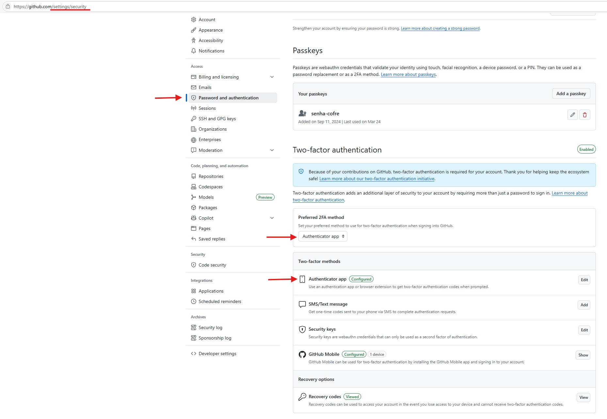

# Duplo Fator de Autenticação 🔐

## :material-shield-alert: Importância da Segurança

O **Duplo Fator de Autenticação (2FA)** é **altamente recomendável** para todos os membros da organização SPLOR no GitHub. Esta medida de segurança é fundamental para **proteger não apenas a conta individual, mas toda a organização**.

!!! warning "Atenção!"
    Lembre-se para além dos [**dados sensíveis**](https://splor-mg.github.io/handbook/blog/-publica%C3%A7%C3%A3o-das-bases-da-receita---an%C3%A1lise-sobre-prote%C3%A7%C3%A3o-de-dados/) dos próprios integrantes da equipe SPLOR, como CPF, e-mails pessoais etc. alguns dos conjuntos de dados geridos pela organização contém **informações sensíveis de terceiros, exigindo ainda mais cuidado e responsabilidade** no controle de acessos e permissões, especialmente com a **segurança da nossa própria senha**.

## :material-lock: Por que o 2FA é Essencial?

**Proteção Contra Invasões!**

O 2FA é um mecanismo que **reduz drasticamente as chances** de alguém ter sua conta invadida. Mesmo que uma senha seja comprometida, o invasor ainda precisará do segundo fator de autenticação para acessar a conta.
Se alguém tiver a conta invadida, isso pode representar um **risco significativo para os dados sensíveis de toda a organização**. 

Uma conta comprometida pode resultar em:

- **Vazamento de dados** confidenciais
- **Alterações não autorizadas** em repositórios
- **Comprometimento** de sistemas em produção
- **Danos à reputação** da organização
- **Problemas legais** e de compliance

---

**🔑 Como Funciona o 2FA**

**Primeiro Fator: Senha**

- A senha que você já usa para fazer login
- Deve ser forte e única

**Segundo Fator: Código de Verificação**

- Código temporário gerado por um aplicativo (mais seguro)
- Código enviado por email
- Código enviado por SMS (menos seguro)

---

**:material-cellphone-key: Métodos de 2FA recomendados:**

Aplicativo Autenticador:

- **Microsoft Authenticator** - [Guia de configuração e uso](https://support.microsoft.com/pt-br/account-billing/baixar-e-instalar-o-microsoft-authenticator-app-351498fc-850a-45da-b7b6-27e523b8702a)
- **Google Authenticator** - [Como começar a usar](https://support.google.com/accounts/answer/1066447?hl=pt-BR)

## :material-github: Configuração do 2FA no GitHub

**Passo a Passo**

1. **Acesse** as configurações da sua conta GitHub
2. **Vá para** "Access" → "Password and authentication"
3. **Role na página** até "Two-factor authentication"
4. **Escolha** o método preferido como "Authenticator app"
5. **Configure** o "Authenticator app" na aba "Two-factor methods"
6. **Salve** os códigos de recuperação
7. **Teste** o login com 2FA

!!! warning "Códigos de Recuperação"
    - Salve os códigos de recuperação em local seguro
    - Use apenas em caso de perda do dispositivo 2FA
    - Cada código pode ser usado apenas uma vez
    - Gere novos códigos se necessário

## :material-file-document: Política da SPLOR

Obrigatoriedade!

- **2FA é obrigatório** para todos os membros da organização
- **Owners** devem ter 2FA configurado
- **Membros** devem configurar 2FA antes de acessar repositórios críticos

## :material-thumb-up: Boas Práticas

### Configuração

- ✅ Use aplicativo autenticador
- ✅ Salve códigos de recuperação
- ✅ Configure backup de dispositivo
- ✅ Teste o login regularmente

### Uso Diário

- ✅ Mantenha o dispositivo 2FA seguro
- ✅ Não compartilhe códigos
- ✅ Use em dispositivos confiáveis
- ✅ Faça logout em dispositivos públicos

### Emergências

- ✅ Tenha códigos de recuperação acessíveis
- ✅ Configure backup de autenticador
- ✅ Documente processo de recuperação
- ✅ Mantenha contato com administradores

## :material-alert: Troubleshooting

### Problemas Comuns

**Aplicativo não gera códigos:**

- Verifique se o relógio está sincronizado
- Reconfigure o QR code se necessário
- Use códigos de recuperação se disponível

**Perda do dispositivo:**

- Use códigos de recuperação
- Entre em contato com administradores
- Configure novo dispositivo

**Códigos não funcionam:**

- Verifique se está usando o código correto
- Aguarde o próximo código se necessário
- Use códigos de recuperação

## 📚 Recursos Adicionais

- [Documentação oficial do GitHub sobre 2FA](https://docs.github.com/en/authentication/securing-your-account-with-two-factor-authentication-2fa)
- [Guia de configuração passo a passo](https://docs.github.com/en/authentication/securing-your-account-with-two-factor-authentication-2fa/configuring-two-factor-authentication)
- [Troubleshooting do 2FA](https://docs.github.com/en/authentication/securing-your-account-with-two-factor-authentication-2fa/troubleshooting-two-factor-authentication) 