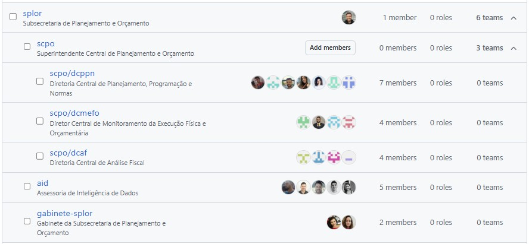

# Equipes 👥

## :material-account-group: Responsabilidade das Unidades

O **responsável por cada unidade da SPLOR** é também o responsável por gerir os membros de sua equipe e deve **adicioná-los nos respectivos times do GitHub**. Na SPLOR, a ideia é que times reproduzam a estrutura administrativa:

Essa organização de equipe permite:

- **Controle de acesso** adequado aos repositórios
- **Gestão de permissões** específicas por equipe
- **Facilitação da comunicação** entre membros da mesma unidade
- **Organização clara** da estrutura administrativa

---

## :material-github: Como Funcionam os Times no GitHub

### Configuração de Times

#### 1. Criação do Time
- Apenas **owners** da organização (membros da AID) podem [criar times](https://github.com/orgs/splor-mg/teams)
- Nome do time deve seguir o padrão: `[SIGLA_UNIDADE]`
- Descrição deve incluir o nome completo da unidade

#### 2. Adição de Membros
- Cada unidade deve [adicionar seus membros](https://github.com/orgs/splor-mg/teams) ao time correspondente
- Membros podem ter diferentes níveis de permissão dentro do time
- Recomenda-se ter pelo menos um **maintainer** por time

#### 3. Permissões de Repositório
- Times podem ter acesso a repositórios específicos
- Permissões podem ser: **Read**, **Write**, **Admin**
- Acesso pode ser concedido a repositórios públicos ou privados

### Benefícios da Organização em Times

#### Comunicação
- **@mentions** (menções) podem ser feitas para times inteiros
- Notificações podem ser configuradas por time
- Facilita a identificação de responsabilidades

#### Gestão de Acesso
- Controle centralizado de permissões
- Facilita a remoção de acesso quando necessário
- Audit trail claro de quem tem acesso a quê

#### Colaboração
- Pull requests podem ser atribuídos a times
- Code reviews podem ser solicitadas de times específicos
- Facilita a distribuição de trabalho
